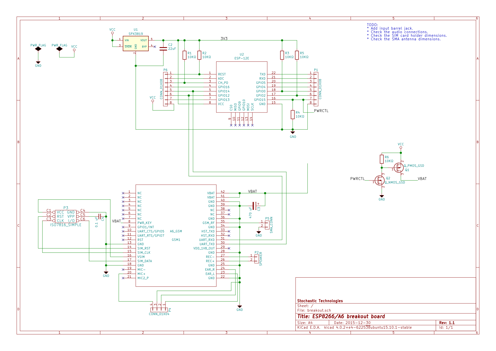

A6-ESP8266-breakout
===================

This is a breakout board that includes an ESP8266 and an integrated A6 module.
It is best used with the [A6 ESP8266
library](https://github.com/skorokithakis/A6lib).

It is still incomplete, and looks like this:

